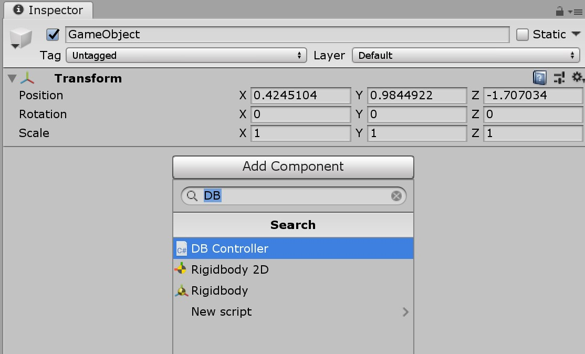
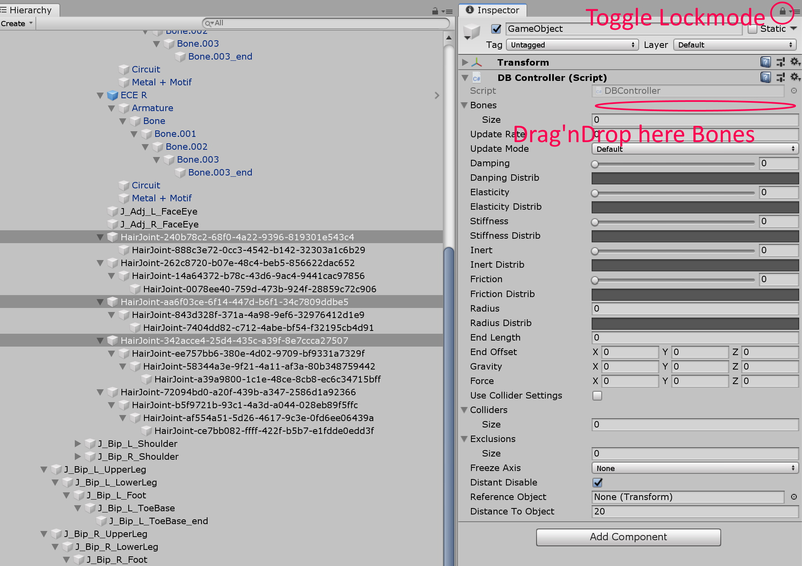

# DBController改

ダイナミックボーンを一括制御するコンポーネントです。
本スクリプトのオリジナルは [halby24 氏の DBController](https://gist.github.com/halby24/2da9679086cdfed9e08f9d23635448ac)です。

This is a component that collectively controls dynamic bones.
this script originate from [halby24's DBController](https://gist.github.com/halby24/2da9679086cdfed9e08f9d23635448ac).

## 利用方法

1. 適当なゲームオブジェクトを作成し、インスペクタで `DB Contoroller` を追加します。

    

2. `Bones` リストでターゲットを指定します。このとき、インスペクタをロックモードにするとドラッグ＆ドロップで一括設定できて便利です。

    

3. ゲームオブジェクト内にターゲットを `Root` とする DynamicBone が生成されます。DB Contoller に値を入力すると、それぞれのDynamicBoneに反映されます。
